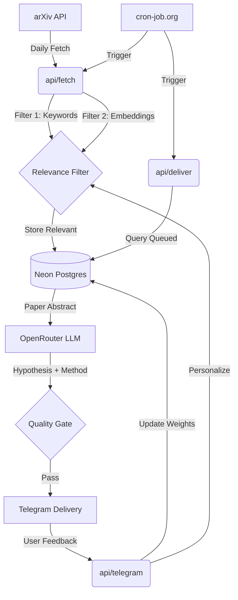

# Axiom Architecture

Axiom is a serverless, event-driven pipeline designed for quantitative research synthesis. It operates on a daily cycle, transforming raw academic papers into actionable trading hypotheses with zero infrastructure overhead.

## System Overview

## Core Components

### 1. Ingestion & Filtering (`api/fetch`)
- **arXiv Client**: Polls specific categories (e.g., `q-fin.PM`, `q-fin.ST`) for papers published in the last 36 hours.
- **Two-Stage Filter**:
    - **Keyword Matching**: Fast pre-filtering against a dynamic list of topics.
    - **Vector Similarity**: Uses `sentence-transformers` (`all-MiniLM-L6-v2`) to compare paper abstracts against a "Seed Corpus" of high-quality reference papers stored in `pgvector`.
- **Deduplication**: Ensures the same paper isn't processed twice across overlapping windows.

### 2. Synthesis (`api/deliver`)
- **LLM Orchestration**: Routes abstracts to OpenRouter (defaulting to Gemini 1.5 Flash for speed/cost, with Claude 3.5 Haiku for "Deep Dive" sessions).
- **Structured Extraction**: The system prompt enforces a rigorous "Senior Quant" persona, focusing on methodology, data requirements, and feasibility.
- **Scoring**: Every idea is assigned a **Novelty** and **Feasibility** score (1-10).
- **Quality Gate**: Only ideas exceeding a combined threshold (default: 13/20) are delivered.

### 3. Delivery & Feedback (`api/telegram`)
- **Interactive Interface**: Ideas are delivered via Telegram Bot API with inline buttons for feedback ("Interesting" vs. "Skip").
- **Dynamic Weighting**:
    - "Interesting" (+1) increases the weight of matching keywords in the database.
    - "Skip" (-1) decreases weights.
- **Personalization**: These weights are applied as multipliers during the next day's filtering stage, allowing Axiom to "learn" your research preferences over time.

### 4. Data Layer (Neon Postgres)
- **Relational Schema**: Manages papers, ideas, authorized users, and feedback.
- **Vector Search**: Leverages `pgvector` for efficient cosine similarity searches in 384-dimensional space.
- **Automated Migrations**: SQL-based schema management for easy deployment.

## Security & Reliability
- **Webhook Secrets**: Verifies Telegram payloads using HMAC constant-time comparison.
- **Cron Authentication**: API endpoints are protected by a `CRON_SECRET` key.
- **Serverless Resilience**: Distributed across Vercel's global edge network, minimizing latency and eliminating single points of failure.
