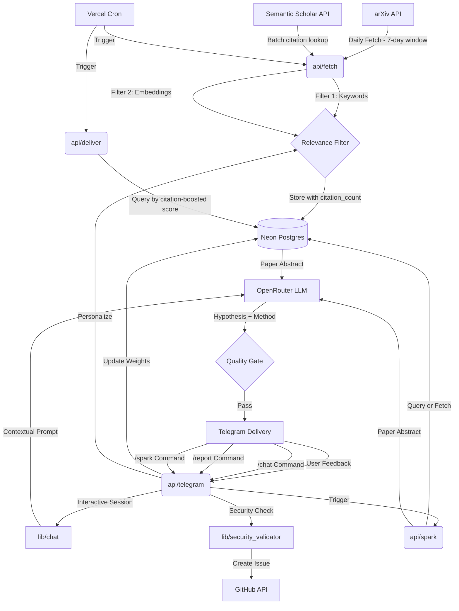

# Axiom Architecture

Axiom is a serverless, event-driven pipeline designed for quantitative research synthesis. It operates on a daily cycle, transforming raw academic papers into actionable trading hypotheses with zero infrastructure overhead.

## System Overview



## Core Components

### 1. Ingestion & Enrichment (`api/fetch`)
- **arXiv Client**: Polls specific categories (e.g., `q-fin.PM`, `q-fin.ST`) for papers published in the last **7 days** (168-hour rolling window).
- **Two-Stage Relevance Filter**:
    - **Keyword Matching**: Fast pre-filtering against a dynamic list of topics from `ALLOWED_TOPICS`.
    - **Vector Similarity**: Uses OpenRouter embeddings (`openai/text-embedding-3-small`, 1536 dimensions) to compare paper abstracts against a "Seed Corpus" of high-quality reference papers stored in `pgvector`.
- **Citation Enrichment**: After inserting papers that pass the relevance threshold, Axiom calls the [Semantic Scholar Graph API](https://api.semanticscholar.org/graph/v1) in a single batch request to fetch citation counts. arXiv IDs are converted to the `ArXiv:YYMM.NNNNN` format (version suffix stripped). Results are stored in `papers.citation_count`. The step is fail-open — a Semantic Scholar outage does not block ingestion.
- **Deduplication**: Ensures the same paper isn't processed twice across overlapping windows.

### 2. Ranking & Selection (`api/deliver`, `api/spark`)
- **Citation-Boosted Score**: At selection time, papers are ranked by a composite score:
  ```
  effective_score = relevance_score + citation_weight × LN(GREATEST(COALESCE(citation_count, 0) + 1, 1))
  ```
  With the default `CITATION_WEIGHT=0.02`, this adds up to ~0.14 to a paper's score for 1 000+ citations, augmenting but never overriding semantic relevance. Papers with no citation data (`NULL`) are treated as zero-cited.

### 3. Synthesis (`api/deliver`)
- **LLM Orchestration**: Routes abstracts to OpenRouter (defaulting to `google/gemini-2.5-flash` for speed/cost, with `anthropic/claude-3-5-haiku` for "Deep Dive" sessions on Fridays).
- **Structured Extraction**: The system prompt enforces a rigorous "Senior Quant" persona, focusing on methodology, data requirements, and feasibility.
- **Scoring**: Every idea is assigned a **Novelty** and **Feasibility** score (1–10).
- **Quality Gate**: Only ideas exceeding a combined threshold (default: 13/20) are delivered.

### 4. Delivery & Feedback (`api/telegram`)
- **Interactive Interface**: Ideas are delivered via Telegram Bot API with inline buttons for feedback ("Interesting" vs. "Skip").
- **Dynamic Weighting**:
    - "Interesting" (+1) increases the weight of matching keywords in the database.
    - "Skip" (−1) decreases weights.
- **Personalization**: These weights are applied as multipliers during the next day's filtering stage, allowing Axiom to "learn" your research preferences over time.
- **Command Handling**: Processes bot commands including `/spark`, `/status`, `/topics`, `/feedback`, `/chat`, `/report`, `/pause`, and `/resume`.
- **Rate Limiting**: `/spark` is rate-limited per user to prevent API abuse.
- **Security**: Webhook payloads are verified using HMAC constant-time comparison. IP allowlisting (optional) further restricts requests to Telegram's known IP ranges.

### 5. Data Layer (Neon Postgres)
- **Relational Schema**: Manages papers, ideas, authorized users, feedback, conversation sessions, and GitHub submissions.
- **Vector Search**: Leverages `pgvector` for efficient cosine similarity searches in **1536-dimensional** space.
- **Automated Migrations**: SQL-based schema management (`migrations/001` through `migrations/010`) for easy deployment.
- **Topic Auto-Sync**: The database automatically stays in sync with your configured `ALLOWED_TOPICS` environment variable whenever fetch or spark endpoints are called.
- **Citation Storage**: `papers.citation_count` (INT, nullable) holds the Semantic Scholar citation count. Existing papers without citation data are progressively backfilled on subsequent fetch runs.

### 6. Research Chat (`lib/chat`)
- **Session Management**: Tracks context across multiple messages per research idea.
- **Contextual Retrieval**: Automatically injects paper abstracts and current idea details into the LLM context.
- **Rate Limiting**: Multi-tier limits (per session, per hour, per day) to prevent API abuse.

### 7. GitHub Issue Integration (`lib/github_client`)
- **Security Validation**: A multi-layer pipeline (`lib/security_validator`) checks for profanity, PII, and injection attempts before submission.
- **AI-Powered Triaging**: Uses LLMs to generate concise issue titles and format detailed markdown bodies with technical context.
- **Traceability**: Submissions are linked to the specific research session and Telegram user for easy debugging.

### 8. On-Demand Synthesis (`api/spark`)
- **Instant Generation**: Triggered by the `/spark` Telegram command to instantly generate a new hypothesis outside the daily schedule.
- **Fallback Search Strategy**: Searches sequentially for:
  1. Unprocessed papers in DB (citation-boosted ranking)
  2. Processed but un-sparked papers (citation-boosted ranking)
  3. A fresh 7-day arXiv fetch with keyword-only scoring
  4. Previously skipped papers re-evaluated against current topics
- **Auto-Syncing**: Guarantees the user's topics are synchronized to the database before processing.
- **Resilience**: Retry logic with configurable fallback model (`FALLBACK_MODEL`) and tunable timeout (`OPENROUTER_TIMEOUT`). The endpoint has a 300-second Vercel `maxDuration` to accommodate slow LLM responses.

### 9. Landing Page & Public API (`api/status`, `api/papers`, `api/chat`)
- **Status Endpoint**: Returns live system health, total paper/idea counts, and last fetch/deliver timestamps.
- **Papers Endpoint**: Returns the 20 most recent non-skipped papers (title, categories, arXiv URL, fetched timestamp). Unauthenticated, CORS-enabled.
- **Chat Endpoint** (`api/chat`): Stateless `POST` endpoint that answers visitor questions about the codebase and architecture. Calls OpenRouter with an inlined system prompt; no auth, no DB, no additional dependencies.
- **Interactive Landing Page**: A static page (`public/`) showing system status, a topic ticker, an expandable papers drawer, and an "Ask Axiom" chatbot widget backed by `api/chat`.

## Security & Reliability
- **Webhook Secrets**: Verifies Telegram payloads using HMAC constant-time comparison.
- **Cron Authentication**: API endpoints verify `CRON_SECRET` via `Authorization: Bearer` header (used by Vercel cron) or `?key=` query parameter (for manual invocation).
- **IP Allowlisting**: Optional `TELEGRAM_IP_ALLOWLIST_ENABLED` flag restricts webhook requests to Telegram's published IP ranges.
- **Fail-Open Design**: External enrichment steps (Semantic Scholar) and non-critical integrations never block the core ingestion or delivery pipeline.
- **Serverless Resilience**: Distributed across Vercel's global edge network, minimizing latency and eliminating single points of failure.
