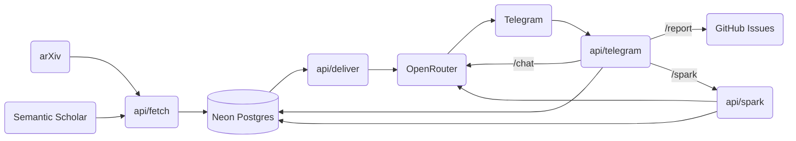

<p align="center">
  
</p>

<h1 align="center">Axiom</h1>

<p align="center">
  <strong>A serverless pipeline for synthesizing quantitative research into actionable trading hypotheses.</strong>
</p>

<p align="center">
  
  
  
  
  
  
</p>

---

Axiom is a lightweight, zero-infrastructure pipeline designed for quantitative researchers and traders. It monitors high-frequency academic outputs (primarily arXiv), applies a two-stage relevance filter enriched with citation signals, and employs state-of-the-art LLMs to synthesize novel research ideas — all delivered daily to your Telegram.

## 🚀 Key Features

- **Automated Ingestion**: Daily polling of `q-fin.PM`, `q-fin.ST`, and more arXiv categories over a rolling 7-day window.
- **Intelligent Filtering**: Combines traditional keyword matching with semantic vector similarity (`pgvector` + OpenRouter embeddings at 1536 dimensions).
- **Citation-Count Enrichment**: After ingestion, Axiom queries the [Semantic Scholar API](https://api.semanticscholar.org/) to attach citation counts to new papers. Highly-cited work receives a log-scaled ranking boost at delivery time (`relevance_score + citation_weight × ln(citations + 1)`), surfacing established results alongside emerging research.
- **Research Synthesis**: Generates structured hypotheses, implementation methods, and data requirements using OpenRouter (Gemini/Claude).
- **Interactive Feedback**: Personalize your research feed via simple "Interesting" or "Skip" buttons in Telegram.
- **On-Demand Ideation**: Request a fresh hypothesis anytime via the `/spark` Telegram command.
- **Research Chat**: Deep-dive into any generated idea using the `/chat` command to discuss implementation details with an AI quantitative expert.
- **Issue Reporting**: Submit bug reports or feature requests directly from Telegram to GitHub via the `/report` command.
- **Dynamic Learning**: The system automatically updates topic weights based on your feedback (auto-synced with your configured topics) to improve future signal quality.
- **Recent Papers Feed**: Click the Papers count on the landing page to reveal an expandable drawer showing the 20 most recent papers with arXiv links, category badges, and relative timestamps.
- **Zero-Cost Operation**: Fully utilizes free tiers of Vercel, Neon, OpenRouter, and cron-job.org. The Semantic Scholar API is also free for low-volume usage (~$0.03/month for high-volume API usage overall).

## 🛠 Tech Stack

Axiom is built for reliability and minimal maintenance.

- **Language**: Python 3.11+
- **Infrastructure**: Vercel Serverless Functions + Vercel Cron.
- **Database**: Neon Postgres with `pgvector` for semantic search.
- **Intelligence**: OpenRouter (Gemini 2.5 Flash for daily runs, Claude 3.5 Haiku for Friday deep-dives).
- **Embeddings**: OpenRouter (`openai/text-embedding-3-small`) at 1536 dimensions for high-precision semantic matching.
- **Citation Data**: [Semantic Scholar Graph API](https://api.semanticscholar.org/graph/v1) for paper citation counts.

> **[Read more about the Tech Stack](TECH-STACK.md)**

## 📐 Architecture

Axiom's architecture follows a classic event-driven pipeline: **Ingest → Enrich → Filter → Synthesize → Deliver → Learn**.



> **[Explore the detailed Architecture](ARCHITECTURE.md)**

## 🚦 Getting Started

Setting up your own instance of Axiom takes less than 15 minutes.

1.  **Clone the Repository**: `git clone https://github.com/your-username/axiom.git`
2.  **Follow the Guide**: See **[INSTRUCTIONS.md](INSTRUCTIONS.md)** for step-by-step setup of Telegram, Neon, and Vercel.
3.  **Seed Your Corpus**: Run `scripts/seed_corpus.py` with 10-20 arXiv IDs that represent your research interest.
4.  **Go Live**: Deploy to Vercel and start receiving daily signals.

## 📂 Project Structure

```text
├── api/             # Vercel Serverless Function entry points
├── lib/             # Core business logic (arXiv, Semantic Scholar, DB, LLM, Telegram)
├── migrations/      # SQL schema management
├── prompts/         # Structured LLM templates (System, Extraction, Ideation)
├── public/          # Landing page (HTML, CSS, JS)
├── scripts/         # Utility scripts (Seed corpus, Register webhook)
└── tests/           # Comprehensive Pytest suite
```

---

<p align="center">
  <i>Built to find signal in the noise.</i>
</p>
